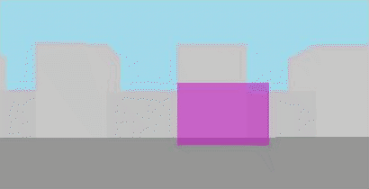

# JCast Engine

[](https://github.com/edgaralexanderfr/jcast/releases/tag/v0.0.1)




##### Table of contents
1. [Getting started](#getting-started)
2. [Contributing](CONTRIBUTING.md)
3. [Credits](#credits)

<a name="getting-started"></a>
## Getting started

Include the minified version of the JCast Engine into the HEAD your HTML file:

```html
<script type="text/javascript" src="/jcast/lib/jcast.min.js"></script>
```

Add a canvas tag into the BODY of your HTML file:

```html
<canvas width="410" height="210"></canvas>
```

Get a reference to your canvas in your JS file or script:

```javascript
var canvas = document.querySelector('canvas');
```

Instantiate and center the camera:

```javascript
var camera = new jcast.Camera({
  farClipPlane: 10
});

camera.transform.position.x =
camera.transform.position.y = 5;
```

Define your coloured materials to be used:

```javascript
var bgMaterial = new jcast.Material({
  color: new jcast.Color({
    r: 162,
    g: 218,
    b: 235
  })
});

var floorMaterial = new jcast.Material({
  color: new jcast.Color({
    r: 150,
    g: 150,
    b: 150
  })
});

var blockMaterial = new jcast.Material({
  color: new jcast.Color({
    r: 195,
    g: 195,
    b: 195
  })
});

var pillarMaterial = new jcast.Material({
  color: new jcast.Color({
    r: 200,
    g: 200,
    b: 200
  })
});

var glassMaterial = new jcast.Material({
  color: new jcast.Color({
    r: 200,
    g: 0,
    b: 200,
    a: 0.5
  })
});
```

Define and instantiate your blocks/walls:

```javascript
var block = new jcast.Block({
  walls: [
    new jcast.Wall({
      material: blockMaterial
    })
  ]
});

var pillarBlock = new jcast.Block({
  walls: [
    new jcast.Wall({
      material: pillarMaterial
    }),
    new jcast.Wall({
      material: pillarMaterial
    })
  ]
});

var glassBlock = new jcast.Block({
  walls: [
    new jcast.Wall({
      material: glassMaterial
    })
  ]
});
```

Create your map:

```javascript
var map = new jcast.Map({
  width: 10,
  height: 10,
  depth: 1,
  name: 'Test Map',
  camera,
  bg: bgMaterial,
  floor: floorMaterial
});
```

Populate your map with your blocks:

```javascript
// Add the glass block:
map.setBlock(8, 5, glassBlock);

// We loop through each border of the map, if the current position is even then we add the normal block, otherwise we add a pillar:

for (var x = 0; x < map.width; x++) {
  map.setBlock(x, 0, (x % 2) == 0 ? block : pillarBlock);
  map.setBlock(x, map.height - 1, (x % 2) == 0 ? block : pillarBlock);
}

for (var y = 0; y < map.height; y++) {
  map.setBlock(0, y, (y % 2) == 0 ? block : pillarBlock);
  map.setBlock(map.width - 1, y, (y % 2) == 0 ? block : pillarBlock);
}
```

Init and start your game with previous canvas and map:

```javascript
var game = jcast.init({ canvas, map });
game.start();
```

Add rotation and bouncing to the camera with an interval:

```javascript
var vrs = 0.01;

setInterval(() => {
  // Rotate horizontally:
  camera.rotate(0, 1 * jcast.Time.deltaTime, 0);

  // Bounce vertically:

  var z = camera.transform.rotation.z;

  if (z >= 1.0 || z <= -1.0) {
    vrs *= -1;
  }

  camera.transform.rotation.z += vrs;
}, 1000 / 60);
```

The result will be the animation from above, you can check out the full source [here](examples/v0.0.1/demo/index.html) and also see the [running example here](https://edgaralexanderfr.github.io/jcast/examples/v0.0.1/demo/). This project is under construction.

<a name="credits"></a>
## Credits

- Lode Vandevenne: https://lodev.org/
